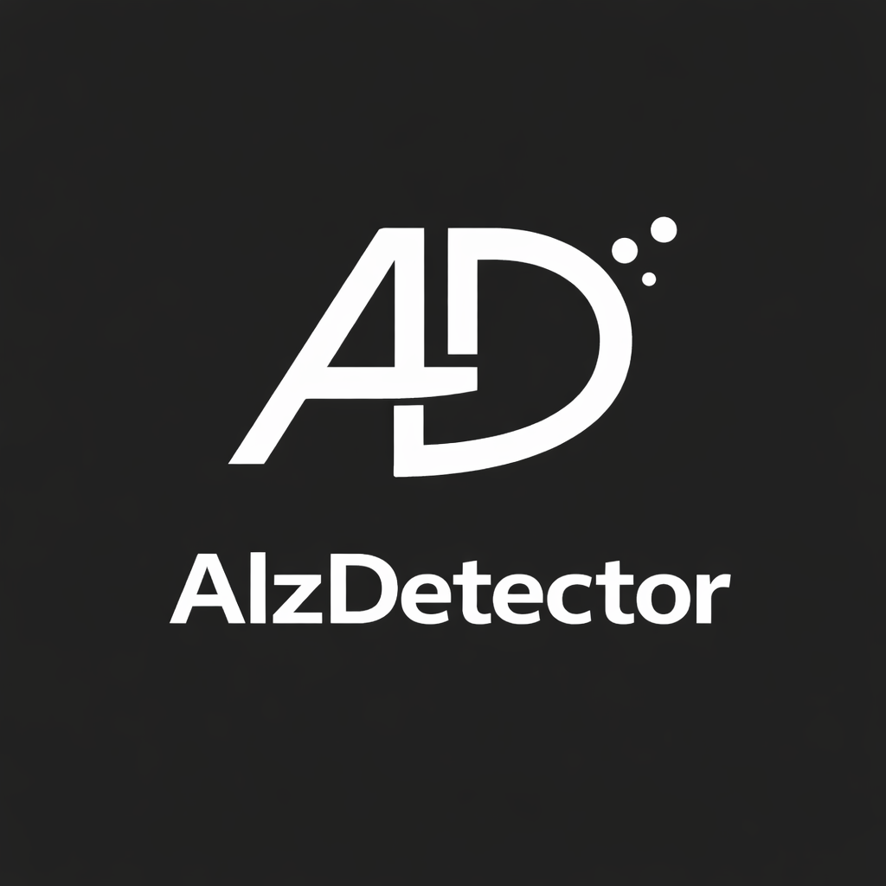
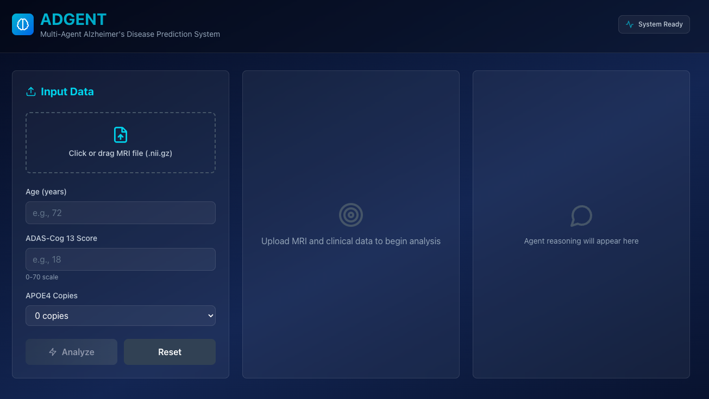
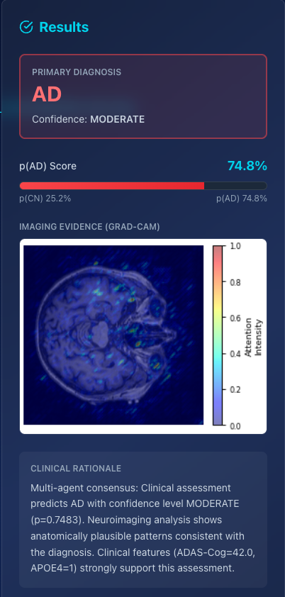

# AlzDetector

 


AlzDetector is a multi-agent system for analyzing clinical and MRI data to assist in Alzheimer's Disease research and prediction.

## Features
- Multi-agent orchestration for data analysis(with CrewAI)
- Clinical CSV and MRI data support
- Model training, evaluation, and visualization
- FastAPI backend and React frontend

## Setup
1. Clone the repository:
	 ```sh
	 git clone https://github.com/vihaankrishna100/AlzDetector.git
	 ```
2. Install Python dependencies:
	 ```sh
	 pip install -r requirements.txt
	 ```
3. Add your OpenAI API key to a `.env` file (not tracked by git).

## Usage
- Run training:
	```sh
	python train.py
	```
- Run evaluation:
	```sh
	python evaluate_model.py
	```
- Start backend:
	```sh
	bash start_backend.sh
	```
- Start frontend:
	```sh
	bash start_frontend.sh
	```

## Data
- Place clinical CSV files in the `data/` folder.
- MRI and DICOM data are excluded from the repository for privacy.
- Utilize cloud source for data storage such as Azure

## GradCAM Imaging/SHAP Model


GradCAMs are a great explainable output that are used mainly for CNNs. I have utilized CrewAI to provide GradCams as a tool for the GradCAM agent. This agent can run the last convolution get the Grad-CAM and interpret it to use it in final natural language explanation. The SHAP model is the same architecture, but instead utilized the MLP. This allows for the architectures to sort of be combined in a sense to create a better, more overall model.

## Future Plans

I plan to continue this project, reiterating it and making it better. My main goal is to create a metric to test explainability and train the model to optimize that. I also plan to fintune the models using GPT-120b-OOS model for better performance. Currently this is an ongoing project with the X-LAB at Kennesaw State University.


## License
MIT License.


